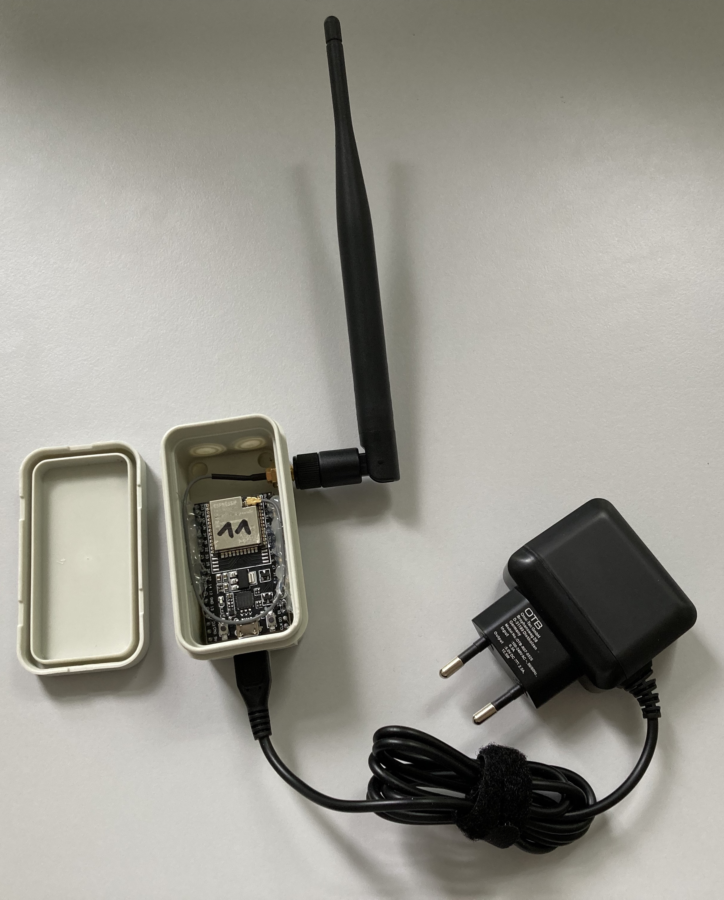

# ESP32 Bluetooth-Logger

Logging bluetooth advertisements for crowd flow analysis was a common method before MAC address randomization was established.
But for the short time of 15 minutes one bluetooth MAC address can be traced anyways.
Even transitions can be recognized between measurements of different loggers.
This repository supplies the firmware for an ESP32 with which it can be used as a Bluetooth-Logger, the measuring device of the [Crowd Flow Analysis](https://github.com/kiliandangendorf/crowd-flow-analysis-with-esp32-bluetooth-logger).

The following figure states the idea of what the subsequent evaluation of rush hours, high-traffic locations, and crowd flow is based on

<p align="center">
    
</p> 


<!-- <p align="center">
    
</p>  -->

## Example Measurement
For each new device every 10 seconds a MQTT-message of the following format will be published.
```json
{ 
  "address": "38:2f:a6:xx:xx:xx", 
  "manufacturer-data": "06000[...]b8", 
  "serviceUUID": "",
  "name": "", 
  "address-type": "1", 
  "timestamp": "1651042693",
  "appearance": "",
  "rssi": "-91", 
  "tx-power": "0",
}
```

# Burn IDs
Use project in folder `esp32_prefs_set_kd_device_id/` to burn serial number on each ESP's permanent memory.

Therefore edit `esp32_prefs_set_kd_device_id/src/main.cpp`:
```cpp
#define KD_DEVICE_ID "newid"
```
Note: This field is meant as an identifier with max length of 5 characters.
If you omit this step, id will be chosen by MAC address of the ESP.

# Config Firmware

Firmware version is defined in `platformio.ini`. 
Increase this value each time you make changes in code.

## Global Config
All other configuration will be done in `src/globals_kd.h`.
This file all other files includes.

### Devices Name
The preset ID will be concatenated at the end of this string.
```cpp
#define DEVICE_NAME_PRE "esp32_ble_scan_"
```

### WiFi
In the WiFi-section you can set up to four different ssid-password-pairs.
Comment out unused lines.
```cpp
#define SSID_AP_1 "ssid_from_AP_1"
#define PW_AP_1 "your_password_for_AP_1"
//#define SSID_AP_2 "ssid_from_AP_2"
//#define PW_AP_2 "your_password_for_AP_2"
```

### MQTT
In the MQTT-section you'll the following values.
Change them accordingly to preferences of your MQTT-Broker.
```cpp
#define MQTT_HOST_CN "example.com"
#define MQTT_USERNAME "sensor_ble"
#define MQTT_PASSWD "Password for sensor_ble"
```

You can customize the topics-prefix.
For the sensor- and admin-topic the current ssid and the burned id will be appended.
Under these topics the Bluetooth-Logger publishes measurements- resp. status-messages.

For the ota-topic only the burned id will be concatenated.
On this topic the Bluetooth-Logger will listen for update instructions.
```cpp
#define SENSOR_TOPIC_PRE "sensor/BLE/Scanner/"
#define ADMIN_TOPIC_PRE "admin/BLE/Scanner/"
#define OTA_TOPIC_PRE "ota/BLE/Scanner/"
```

### TLS
Use your root certificate (as stated [here](https://github.com/kiliandangendorf/crowd-flow-analysis-with-esp32-bluetooth-logger#create-certificates)).
Paste the result of e.g. `cat ca.crt` as multiline string in section TLS.

# Compile and Upload
This project was setup with [PlatformIO](https://platformio.org).
After compiling binary firmware files will be found in `.pio/build/esp32dev/`.

Either you use PlatformIO to upload firmware.
Or you upload the bin-file at an HTTPS server and send ota-message to remote Bluetooth-Logger as stated [here](https://github.com/kiliandangendorf/crowd-flow-analysis-with-esp32-bluetooth-logger#ota-update).

# License

[Licensed under the MIT License](https://opensource.org/licenses/MIT).

This software was developed in the context of my master thesis, which I wrote in the company [ATMINA Solutions GmbH](https://atmina.de).


